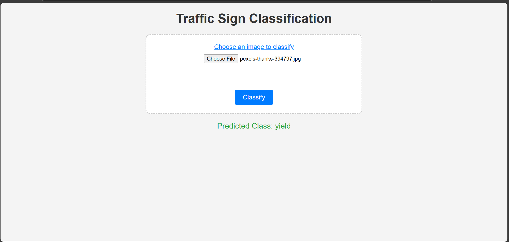

# Drive Aware
## Vehicle Behavior Analysis for Driver Assistance

## Project Overview
This project focuses on using computer vision and machine learning to analyze the behavior of vehicles around the driver and provide real-time advice. Based on the observed traffic situation (such as the proximity of nearby vehicles), the system predicts whether the driver should yield, stop, or proceed. This system aims to assist drivers in making safer decisions on the road.

## Problem Statement
In traffic, making the right decision at intersections or during merging can be critical to avoid accidents. Drivers may often need to decide whether to stop, yield, or proceed based on the vehicles around them. This project uses AI to analyze the behavior of surrounding vehicles and provide real-time suggestions to help drivers make safer decisions.

## Proposed Solution
We designed a system that uses the following techniques:
- **Vehicle Detection**: We use object detection to identify nearby vehicles in the driver’s surroundings.
- **Situation Analysis**: Based on the positions and movements of nearby vehicles, the system predicts whether the driver should stop, yield, or proceed.
- **Driver Advice**: The system generates real-time advice on what action the driver should take (Stop, Yield, Proceed) based on the analysis of the surrounding traffic situation.

### Key AI Techniques Used:
1. **Object Detection**: Detects nearby vehicles using YOLOv8.
2. **Situation Analysis**: A machine learning model analyzes vehicle positions and predicts the best course of action (stop, yield, or proceed).
3. **Driver Assistance System**: Provides real-time recommendations based on the analysis of the traffic environment.

## How It Works
1. **Vehicle Detection**: The system uses YOLOv8 for detecting vehicles within the frame captured from a camera.
2. **Situation Analysis**: The model analyzes the positions, speed, and direction of nearby vehicles. The system considers whether vehicles are close to an intersection, moving towards the vehicle, or stopping.
3. **Decision Prediction**: Based on the analysis, the system predicts the appropriate action for the driver:
   - **Stop**: If vehicles are approaching or blocking the path.
   - **Yield**: If the situation requires caution but proceeding is safe.
   - **Proceed**: If the way is clear and it’s safe to continue.

## Demo

1. **Input**: Upload a video or live feed containing surrounding vehicles.
2. **Processing**: The system detects nearby vehicles and analyzes their positions and movement.
3. **Output**: The system advises the driver to "Stop", "Yield", or "Proceed".

### Example Output:
- "Advice: Stop"
- "Advice: Yield"
- "Advice: Proceed"

## Results & Impact
This system assists drivers by providing real-time traffic analysis and advice, helping them make safer decisions. The model provides predictions based on the current situation, allowing drivers to avoid potential collisions and navigate intersections safely.

## Future Scope
- **Real-time Integration**: Integrate with in-car systems for real-time decision-making.
- **Improved Accuracy**: Enhance the model's ability to handle complex driving environments and multiple vehicles.
- **Expanded Dataset**: Train on more diverse datasets with different road conditions, times of day, and weather.

## Screenshots

### Example:


## Technologies Used
- **Python** for model development and backend.
- **TensorFlow/Keras** for deep learning model development.
- **YOLOv8** for vehicle detection.
- **Flask** for web app deployment.
- **OpenCV** for image and video processing.

## Installation & Setup

### 1. Clone the repository:
```bash
git clone https://github.com/yourusername/vehicle-behavior-analysis.git
cd vehicle-behavior-analysis
